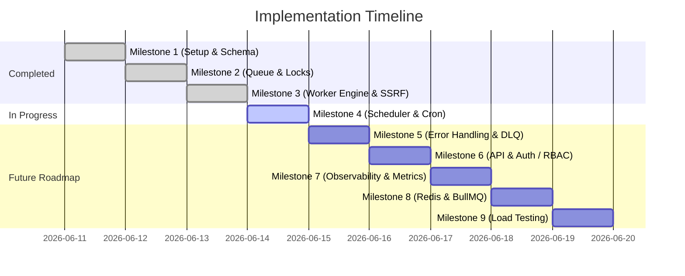

# 🚀 Next Steps Roadmap

This document outlines the detailed roadmap, architecture, and step-by-step instructions for implementing the remaining milestones of the **Production-Grade Distributed Job Processing Platform**.

---

## 📊 Project Status & Progress Tracker



---

## ⏱️ Milestone 4: Scheduler & Recurring (Cron) Jobs (Immediate Next Step)

The Scheduler Daemon periodically checks the database for delayed jobs whose execution time has passed (`runAt <= NOW`) and promotes them from `PENDING` to `QUEUED`. It also handles rescheduling recurring jobs on completion or failure.

### Action Items & Implementation Plan

1. **Install cron parser dependency**:
   ```bash
   npm install cron-parser
   ```
2. **Implement Cron Parser Helper** inside [src/shared/utils/cron.ts](file:///home/abhijit_1859/Documents/learn-codes/distri/src/shared/utils/cron.ts):
   - Use `cron-parser` to calculate the next date occurrence relative to the current time.
3. **Update Database Queue completion/failure transaction** in [src/core/queue/database-queue.ts](file:///home/abhijit_1859/Documents/learn-codes/distri/src/core/queue/database-queue.ts):
   - **Success**: If the job has a `cronExpression`, calculate the next run time, and update the state back to `PENDING` (instead of `COMPLETED`) with `retriesCount` reset to `0`.
   - **Failure**: If a cron job runs out of retries, instead of stopping forever, reschedule it for its next cron execution tick as `PENDING`.
4. **Create Scheduler Daemon** in [src/core/scheduler/scheduler.ts](file:///home/abhijit_1859/Documents/learn-codes/distri/src/core/scheduler/scheduler.ts):
   - Implement a daemon polling loop using `setTimeout`.
   - Run a batch update transaction to promote jobs:
     ```sql
     UPDATE "jobs" SET "state" = 'QUEUED' WHERE "state" = 'PENDING' AND "run_at" <= NOW()
     ```
5. **Update system bootstrapper** in [src/index.ts](file:///home/abhijit_1859/Documents/learn-codes/distri/src/index.ts) to handle the `scheduler` role.
6. **Verify Scheduler performance** using verification script [src/scratch/test-scheduler.ts](file:///home/abhijit_1859/Documents/learn-codes/distri/src/scratch/test-scheduler.ts).

---

## ⚠️ Milestone 5: Error Handling, Retries & Dead Letter Queue (DLQ)

Build a resilient retry framework that acts differently based on transient vs. fatal errors, using customizable backoff patterns.

### Action Items & Implementation Plan

1. **Classify Failures**:
   - **Transient**: Network timeout, HTTP `5xx`, Rate Limiting (`429`). These should trigger retries.
   - **Fatal**: SSRF validation blocks, HTTP `400`, `401`, `403`, `404` (unless configuring custom retry triggers). These should fail immediately and move to DLQ.
2. **Add Jitter to Exponential Backoff** in [src/shared/utils/backoff.ts](file:///home/abhijit_1859/Documents/learn-codes/distri/src/shared/utils/backoff.ts):
   - Prevent thundering herds by adding a random jitter factor:
     $$\text{delay} = (\text{backoffDelay} \times 2^{\text{attempt}}) \times (0.8 + \text{random}() \times 0.4)$$
3. **Verify Execution History**:
   - Confirm that the `JobExecution` logs accurately document stack traces, error messages, and network status codes for every retry attempt.

---

## 🛡️ Milestone 6: API Management & Authentication

Provide a secure administration surface to manage and cancel running jobs, using standard authentication mechanisms.

### Action Items & Implementation Plan

1. **Complete REST Endpoints** in [src/api/routes/job-routes.ts](file:///home/abhijit_1859/Documents/learn-codes/distri/src/api/routes/job-routes.ts):
   - `POST /api/v1/jobs` - Enqueue job.
   - `GET /api/v1/jobs/:id` - Fetch details and attempt logs.
   - `GET /api/v1/jobs` - List jobs with filtering on `state` and pagination.
   - `POST /api/v1/jobs/:id/cancel` - Cancel a job.
2. **Implement Safe Job Cancellation**:
   - Update `cancelJob` in [src/api/controllers/job-controller.ts](file:///home/abhijit_1859/Documents/learn-codes/distri/src/api/controllers/job-controller.ts).
   - A job can only be cancelled if it is `PENDING` or `QUEUED`. If it is `RUNNING`, return a warning/conflict error.
3. **Enforce JWT & RBAC Middleware**:
   - Add authentication middleware.
   - Differentiate roles: `admin` can cancel jobs, `user` can view/create jobs.

---

## 📊 Milestone 7: Observability, Metrics & Audit Logs

Expose telemetry data to enable monitoring systems (Prometheus, Grafana) to scrape current queue lag, throughput, and error rates.

### Action Items & Implementation Plan

1. **Install Prometheus Clients**:
   ```bash
   npm install prom-client
   ```
2. **Register Global Metrics**:
   - `jobs_processed_total` (counter, labeled by state `COMPLETED` | `FAILED`)
   - `queue_lag_seconds` (histogram, tracking latency from scheduled `run_at` to actual worker locking time)
   - `active_workers_gauge` (gauge tracking active concurrency saturation)
3. **Expose scraping endpoint**:
   - Bind Express route `/metrics` to return raw Prometheus metrics formatting.

---

## 🏎️ Milestone 8: Redis & BullMQ Migration

Abstract the queue engine behind a driver pattern to allow toggling between PostgreSQL (for simplicity in development) and Redis/BullMQ (for ultra-high performance in production).

### Action Items & Implementation Plan

1. **Define Unified Queue Interface**:
   ```typescript
   export interface QueueDriver {
     enqueue(name: string, payload: any, options?: any): Promise<any>;
     cancel(jobId: string): Promise<void>;
   }
   ```
2. **Implement Redis Stream Driver**:
   - Integrate `bullmq` queue and worker processors.
3. **Add Toggle Configuration**:
   - Read `QUEUE_DRIVER=database` or `QUEUE_DRIVER=redis` inside `.env` to instantiate the appropriate driver at startup.

---

## 🧪 Milestone 9: Concurrency Load Testing

Verify system behavior under extreme load conditions.

### Action Items & Implementation Plan

1. **Concurrency Stress Tests**:
   - Inject 10,000+ jobs concurrently.
   - Spin up 5 workers running with concurrency limit of 10 each.
2. **Correctness Checks**:
   - Confirm zero duplicate executions (no double-locking occurred).
   - Ensure the database connection pool remains stable.
